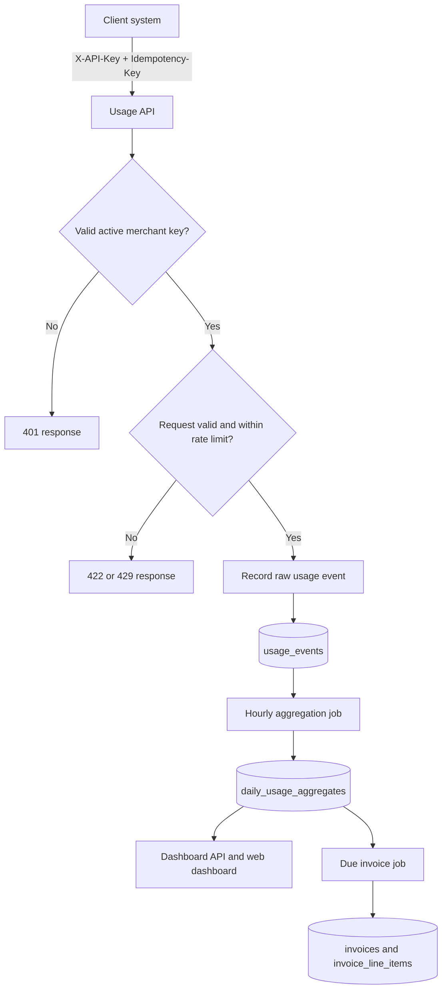
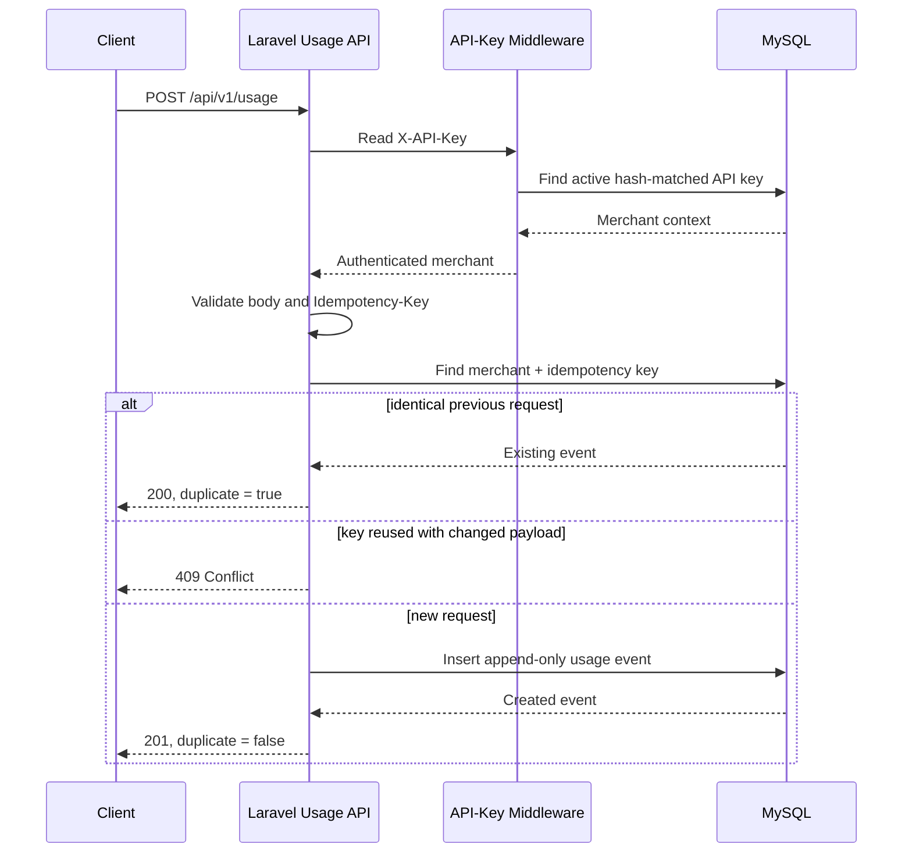
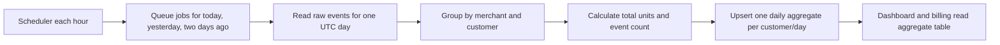
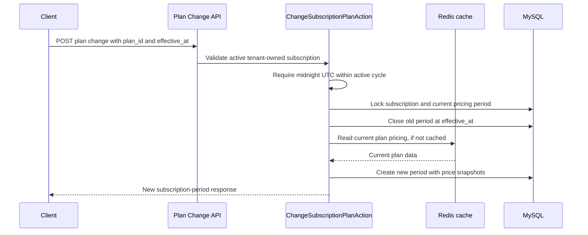
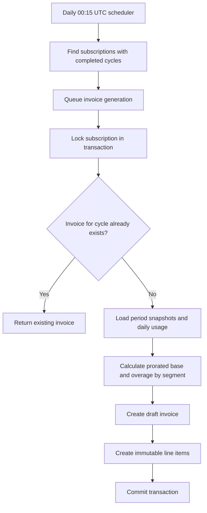
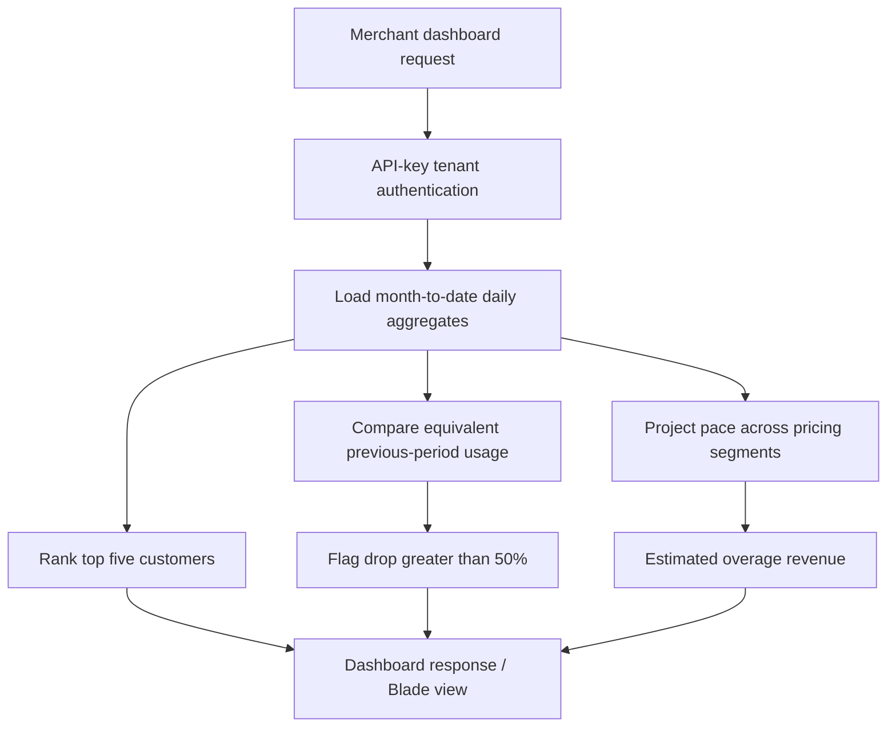
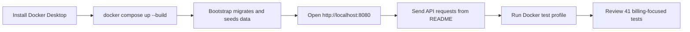

# Subscription Billing — Flow Document

## 1. End-to-end system flow



## 2. Usage ingestion flow



### Why this flow is safe

1. The merchant is not accepted from user input; it comes from the authenticated key.
2. A canonical payload hash includes the customer ID, quantity, normalized UTC timestamp, and metadata.
3. A database unique key is the final duplicate safeguard if requests arrive simultaneously.
4. Usage is durable before background aggregation starts, so an interruption does not lose events.

## 3. Daily aggregation flow



The job recalculates a small recent window rather than only processing “new” events. This makes the aggregate correct even when an event arrives late or a job retries.

## 4. Plan-change flow



The snapshot stores plan name, base price, included units, overage rate, and billing cycle. Later edits to the current plan do not change the prior period.

## 5. Invoice generation flow



### Calculation example

For a 30-day cycle, a plan active for 10 days with a $30.00 monthly price and 300 included units contributes:

```text
base charge    = round(3000 cents × 10 / 30) = 1000 cents
included units = floor(300 × 10 / 30) = 100 units
overage        = max(0, segment usage - 100) × segment overage rate
```

Each plan segment is calculated separately. This is what makes an upgrade or downgrade in the middle of the month fair and explainable.

## 6. Dashboard flow



The projected-overage number is an estimate based on observed month-to-date pace. It is clearly separate from a generated invoice.

## 7. Local validation flow



Recommended verification command:

```bash
docker compose --profile test run --rm --build test
```

## 8. Failure-handling summary

| Risk | Protection in the flow |
| --- | --- |
| Duplicate client retry | Merchant-scoped idempotency key and payload hash. |
| Concurrent duplicate writes | Database unique constraint and duplicate recovery. |
| Late usage event | Recent days are recalculated each hour. |
| Duplicate invoice job | Transaction, subscription lock, and unique invoice-cycle index. |
| Price edited after signup | Immutable subscription-period snapshot. |
| Cross-merchant access | API key resolves tenant before business logic. |
| Raw-event table grows large | Reporting uses daily aggregates and indexed date ranges. |
